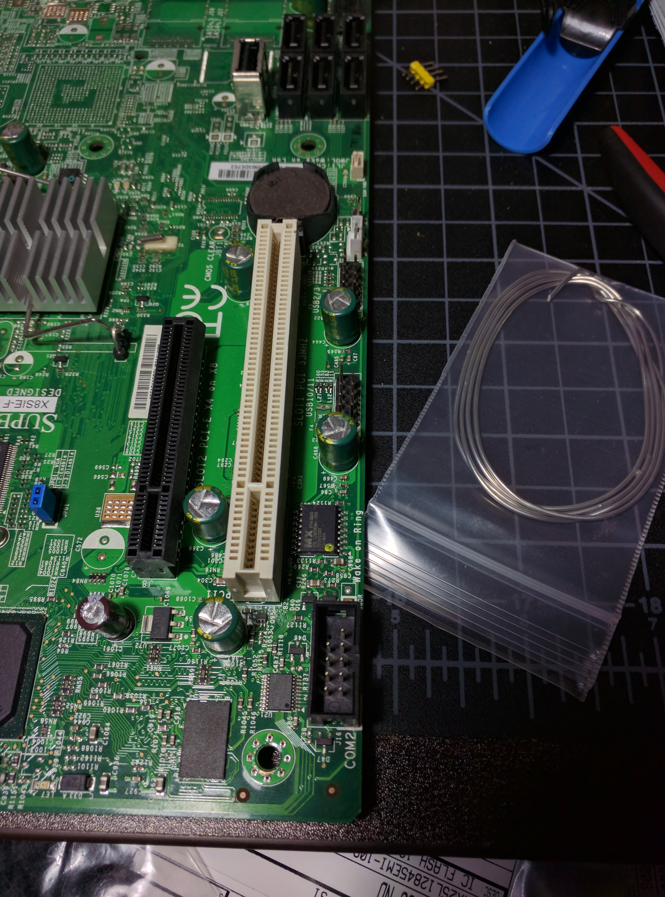
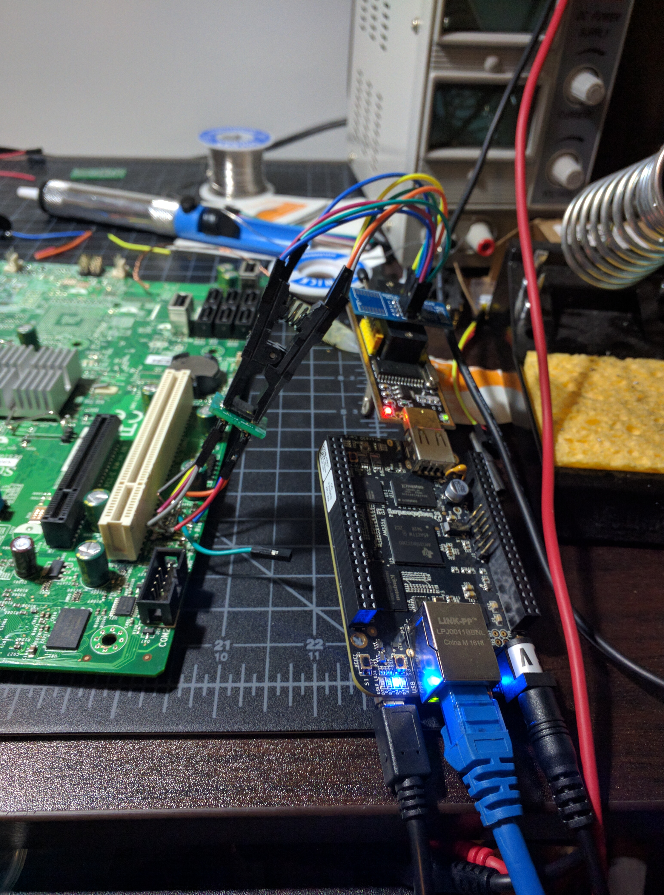
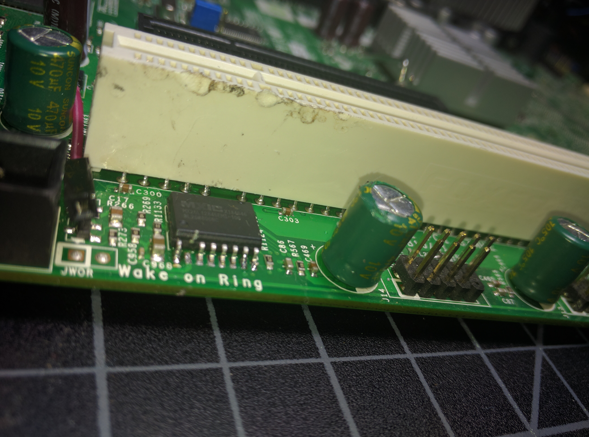
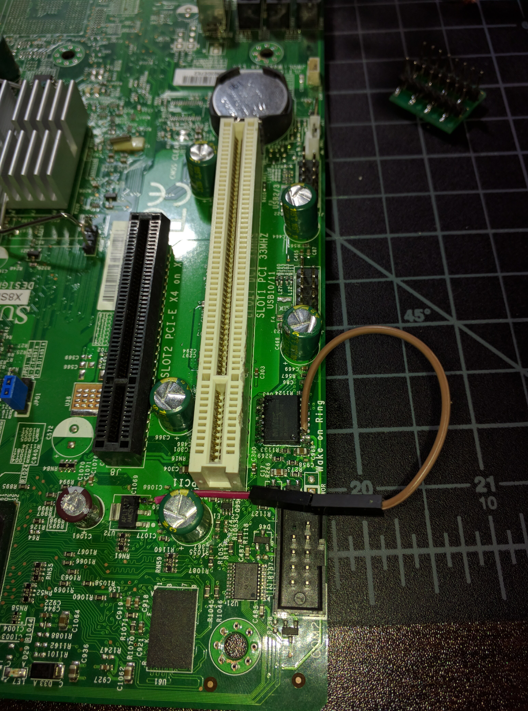

# Flashing firmware

Since I'm inevitably going to brick the standard update mechanism trying to
replace the firmware on the BMC, the first thing I wanted to do is figure
out how to externally update the firmware.

Before getting started, I should point out a series of [blog posts](http://blog.devicenull.org/2014/05/28/removing-ipmi-flash-memory.html)
by Brian "devicenull" Rak, who attempted a similar project three years ago.

Since Brian used the X8SIL-F board, I'm gonna start my investigation
with that series of boards. My own X8SIL-F ($30 on ebay) is still in the
mail, but I do have an X8SIE-F lying around, which is essentially the same
board component-wise, but with a different board layout.

I was hoping to avoid desoldering the memory chip, so I ordered a [SOIC clip](https://www.digikey.com/product-detail/en/3m/923665-16/923665-16-ND/30861) that can attach to the chip while still soldered to the board (well, actually I ordered several kinds, since I didn't know which one was the right one, but the linked one turned out to work well). In addition, I got several replacement memory chips, a set
of the soic emulator pins Brian used for his project, as well as a cheap SPI flash programmer (plus jumper cables and other basic necessities).

So, with no further ado, this is what the programmer looks like when attached to the SOIC clip:

Luckily [flashrom](www.flashrom.org) natively supports my programmer, so there
was little further work to set that up. As a sanity check that the pins were wired
up correctly, I read/wrote one of the replacement. The process takes about 2 minutes,
which is a bit slow, but did complete successfully.

Much to my disappointment, the same was not true when I tried to read the flash chip
in-situ. Several of the LEDs on the board did turn on however. In this situation,
the [flashrom wiki](https://www.flashrom.org/ISP) suggests powering the board by
the normal motherboard. I attempted this as well (with the BMC jumper disabled to
ensure it wasn't trying to simultaneously read), but in neither situation was flashrom
able to detect the chip in situ (it is possible that something else on the board
was attempting to use the SPI bus - at the time I didn't have my oscilloscope operational, so it's hard to tell).

Begrudgingly, I thus decided to desolder the chip. The idea being to resolder a
soic emulator and connect the chip with a couple short wires. The desoldering
was made a bit more difficult by my complete lack of SMT (de)soldering experience,
as well as PCI connector being very close to the memory chip:

I ordered some SMD removal solder which I had heard good things about and though
it wasn't quite as easy as adviced (at least to an SMT soldering newcomer like me),
it did the job quite nicely and I was able to desolder the chip:

With the chip desoldered, I was finally able to extract the firmware from the chip.
SUCCESS! I quickly soldered the SOIC emulator in place, soldered some wires to it
and then soldered the chip to a small adapter PCB. The whole setup looked like this

Unforunately, this didn't work (the programming did, but powering up the board failed). Again the lack of an oscilloscope made precise
debugging difficuly (I did verify connectivity between the chip pins and the board
and checked for shorts, etc), but I suspect the impromptu solder connections
took a toll on the signal integrity of the SPI bus (which is actually surpisingly
highly clocked).

It took a bit of tinkering, but I was eventually able to come up with a solution,
which seems obvious in retrospect and could have saved me some time. The original problem with the soic clip was that it would power up parts of the rest of the board.
However, this was only the case because the Vcc pin was connected to the board at
the time. If we could somehow disconnect the Vcc pin for the duration of the
SPI operation, we'd be in good shape. So, I did just that. I removed the contraption,
soldered in one of the replacement chips (didn't want to put the original chip through too much additional soldering), bent up the Vcc pin

and soldered a small bypass between the Vcc pin and the 3.3V voltage regulator (which seemed like the obvious place, obviously 3.3V is present at other pins on the board).
The setup looked like this:

And with this, I was finally able to have it both. With the power cable connected, the
board would happily boot from the flash chip, with the power cable disconnected, it would happily be programmed using the soic clip (taking advantage of the fact that the contact on the clip is quite large, so it has no trouble making contact with the bent-up pin - however, even if that didn't work, I could have used the bypass cable to grab 3.3V from the SPI programmer). And with that GRAND SUCCESS! I can read/write firmware from the flash chip. Onward to actually figure out what to write on the thing.

P.S.: Yes, I do realize that the beaglebone has an SPI master, which would have probably been better than the USB programmer. But hey, it worked.
